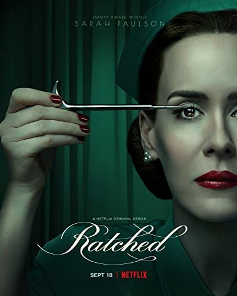

The typography chosen for the new Netflix show *Ratched* - is mesmerizing and eye-catching elegant swirls add to the nostalgic 1940s feeling and promises a show that one would not easily forget.

The new Netflix TV show *Ratched* offers an unforgettable re-imagining of the iconic character of nurse Mildred Ratched from *One that Flew Over the Cuckoo`s Nest* filled with plot twists and characters that will keep you on your toes.

The same thing could be said about the typography chosen for title of the show. Many would recognise the name Ratched - relating to the character of the classic movie and novel it comes from - others would consider the connotations attached to the name. Nurse Ratched has been used a symbol to illustrate the problems within mental health institutions and often is viewed as a hard, cold and authoritarian character. By choosing this soft **BP Black White Cut Off** sans-serif typeface the creators of the show indicate that this version of nurse-Ratched will hold more than the cold and hard side the audiences know from before. Furthermore, the font has a sense of old-school nostalgia, which comes from that it appears to be hand-written, and fits into the show`s 1940s setting. Another effect of the typeface is that it has a more personal feel, which brings back to the shows idea of re-imagining the character by showing her origin story.

In addition, the typeface chosen has a hint of mystery around it, and the elegant swirls and lines in the font going up and down are a nod to the show overall which has plenty of suspenseful moments but radiates elegance and poise similarly to character of Mildred Ratched herself.

Moreover, when looking at the complete poster of the show the typeface instantly captures attention because of its white colour, which contrasts with the overall dark imagery. The choice of the font colour is also quite interesting. The colour white is often associated with innocence which offers a disparity with how the character of Nurse Ratched is usually perceived in popular culture. However, the choice of colouring is indicating to the twisted nature of the show and Mildred Ratched, hinting to the audience that things are not always the way they appear to be.

*Ratched* is a dark, thrilling, twisted and captivating Netflix debut. The choices made in design and typography of the poster captures both the shows and nurse Mildred Ratched`s nature brilliantly.

*Ratched* is a dark, thrilling, twisted and captivating Netflix debut and the choice in BP BlackWhite Cut Off sans-serif typeface for the poster captures both the elegance and timelessness of the character of nurse Mildred Ratched brilliantly. Furthermore, even if one has not yet seen the first season of this fascinating TV Show the typography and design as well as the connotations attached to the character of Nurse Ratched can offer a glance of what to expect of the series.