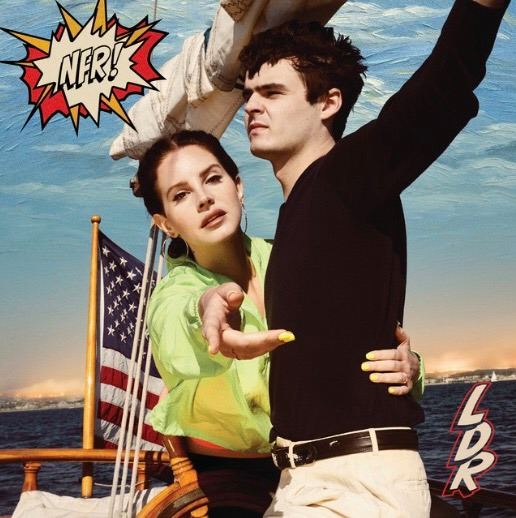

[Comic book style](https://www.interviewmagazine.com/music/lana-del-rey-norman-fucking-rockwell) typeface is brought back to fashion by the latest Lana Del Ray album *"Norman Fucking Rockwell".* 

"*Norman Fucking Rockwell»* newest Lana Del Ray album brings a sense of longing and nostalgia to America that could have been by referencing iconic events, and figures in popular culture. 

**[Biff Bam Boom Outline](https://fontmeme.com/norman-fucking-rockwell-font/)** font chosen for the album`s cover is similar to the typefaces typically used in comic books, which adheres to albums theme of pop culture. The idea of a comic book is strengthened further by the imagery surrounding the title. A red and orange spiky speech bubble, which reminds of a speech or action bubbles used in graphic novels, appears to call for audience attention and helps to draw attention to title written in sans-serif, bold font with same-height letters. In addition, the shadowing around the letters creates an almost 3D visual which makes the title to stand out among the light beige colour of the background. 

Moreover, the comic-style typography used in the album cover has a sense of playfulness about it and makes the title to appear more dynamic.

Furthermore, when looking at an overall appearance of the album\`s cover the title is one of the first things to grab audience\`s attention besides the main photograph of Lana and a mystery guy. The imagery of the album is a nod to American pop culture with, American flag, the Kennedy boat and the title relating to American illustrator [Norman Rockwell](applewebdata://97DDD0F2-F473-4719-8683-E456F267E9AB/-%20https:/www.nrm.org/about/about-2/about-norman-rockwell) whose works were known to be reflective of the popular culture in America. Therefore, the typeface in the title works well with the main theme both alluding to comic books and the illustrator as important parts of the aforementioned culture.

From Old Hollywood glamour to pop culture - Lana Del Ray is known for having thematic approaches to her albums which all give a nod to some part of American culture and are known for their impeccable aesthetic. Her latest album "*Norman Fucking Rockwell» cover* is not one to disappoint in regard to design either - it makes comic-book style typefaces like Biff Bam Boom Outline seem trendy again and using pastiche imagery to reflect the main theme of the album. Even if one has not heard Lana Del Ray`s songs (if such thing is still possible) the effect of the album cover is eye-catching and the bold lettering of typeface only adds to this effect encouraging you to pick up the album, even if it is only to try and decipher what all the imagery means.

**References:**

* Burger, M.A. (2019). *A Visual History Of Lana Del Rey’s Most Peculiar Album Art*. \[online] Interview Magazine. Available at: https://www.interviewmagazine.com/music/lana-del-rey-norman-fucking-rockwell \[Accessed 3 Oct. 2020].

‌

* Fontmeme.com. (2019). *Norman Fucking Rockwell Font*. \[online] Available at: https://fontmeme.com/norman-fucking-rockwell-font/.

‌

* NRM Admin (2016). *Norman Rockwell - A brief biography - A career in illustration*. \[online] Norman Rockwell Museum. Available at: https://www.nrm.org/about/about-2/about-norman-rockwell/.