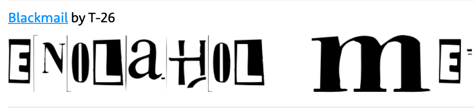
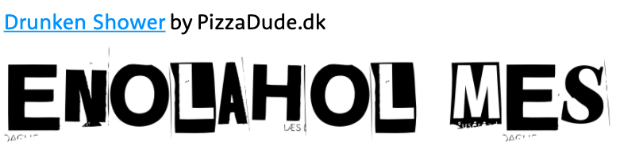
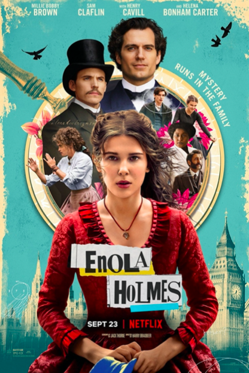

*"Enola Holmes"* typography is an enigmatic, newspaper cutting style font which offers an interesting riddle fitting with the movie`s storyline and its main characters.

Netflix\`s "Enola Holmes" has a truly creative typeface. It seems to imitate a newspaper cutting or ransom note style fonts, therefore there\`s a use of both serif and sans-serif letters in the title. Furthermore, looking closer to the title the surrounding rectangle looks like a paper clipping strengthening the idea that the font was used to imitate a newspaper cutting or ransom note. There seems to be a variety of sans serif and serif fonts, most letters have different width, some of them are bold and the others seem more delicate leading to a conclusion that there is a mixture of high and low contrast letters. The font used for the movie`s title is a custom made one, which seems to be a mix of **Blackmai**l and **Drunken Showe**r fonts:

In addition, because of its "cut and paste" nature the font appears to be more dynamic, casual and leaning more toward the squalor type. This makes it a perfect typeface to represent its young and ambitious main character Enola Holmes. The choice of the typography seems really fitting to the movie`s main themes of mystery, detectives and puzzles as well as the storyline - relating to how Enola tries to solve the mystery of her missing mother and how she tried to communicate with her mother, using their own secret code, through putting messages in the newspaper and decoding them.

Moreover, when looking, at the complete movie poster, the design choices for the title seem to attract even more attention. The colour of the font is black, giving a nod to an Arthur Conan Doyles classic novel *"Sherlock Holmes"* as black is usually suggested to be "classic" colour in fashion. However, the choice of typography and the choice of bold, blue and yellow, coloured rectangles suggests another angle to a Sherlock Holmes story we all know and love - just from the first glance, at the title and its design, most audience can sense that Netflixs *"Enola Holmes"* will offer something new and exciting to the beloved classic. 

 References:

* Gillespie, D. (2020). *Enola Holmes Movie Posters Tease A New Perspective On Sherlock*. \[online] ScreenRant. Available at: https://screenrant.com/enola-holmes-movie-posters-characters-sherlock-mycroft/ \[Accessed 10 Oct. 2020].
* IMDb. (n.d.). *Enola Holmes (2020)*. \[online] Available at: https://www.imdb.com/title/tt7846844/mediaviewer/rm559653377 \[Accessed 9 Oct. 2020].

‌