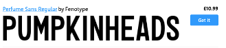
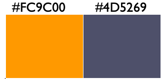

The typography of Rainbow Rowell`s *"Pumpkin Heads"* is big, bold and dynamic, perfectly reflecting the youthfulness of the graphic novel and its characters, promising a cosy story for cold autumn evening reads.

*“Pumpkin Heads”* is a graphic novel by Rainbow Rowell, illustrated by [Faith Erin Hicks](https://ew.com/books/2018/09/14/pumpkinheads-cover-reveal-rainbow-rowell/) which focused on two best friends Deja and Josiah and their last adventure at the pumpkin patch where they both work, before  it is time leave for university. The typeface chosen a nice representation of the novel. It is a bit *difficult* to say with certainty which exact font was used for title, but it appears to be a stylized version of either **Perfume Sans Regular** or **Perfume Sans Medium** fonts: 

This sans-serif, squalor font represents the fun, youthful and informal nature of the book. In addition, the unevenness of the letters, seen in slight height variations, strengthens the squalor aesthetic as well as adds a more dynamic and easy-going look for the font. The design choices for the typography suits both the aforementioned nature of the novel as well as target audience of young-adults and teens buying the book. 

Furthermore, typography is important in the overall image of the book cover. The boldness, size of the font and the bright orange **(#FC9C00)** colour of the letters pops out in the dark blue **(#4D5259)** background which instantly catches the readers attention. The choice of the letter colouring is symbolic for the novel – representing the season of autumn as well as the pumpkins/pumpkin patch were the action of the novel is centered. Moreover, the slightly smushed look of the font in title, there isn\`t much space between letters as well as the two words “Pumpkin Heads”, imitate the two main character, Deja\`s and Josiah\`s, closeness in the illustration. This typographical design choice represents novel\`s prominent themes of friendship and romance. 

 *“Pumpkin Heads”* cover is a great example of how usages of typography, symbolically, without many literal illustrations, still manages to construct a design that showcases the important aspects of novel. Even though the typographical and other design choices for Rainbow Rowell’s and Faith Erin Hick`s graphic novel *“Pumpkin Heads”* were not extravagant rather simplistic, they still carry on, creating a lovely image that\`s both representative of the novel\`s themes, setting, and characters as well as  is attractive for young readers looking for a perfect autumn story.