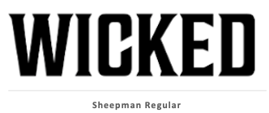
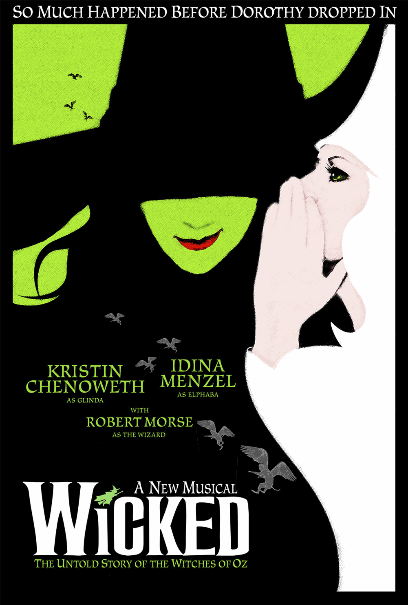

Read on to see how witches, spells and catchy songs were embodied in this wickedly enchanting font....

### **BOOK TO PLAY:**

The origin story of the iconic 2003 Broadway musical *"Wicked"* starts with the 1995 novel by Gregory Maguire *"Wicked: The Life and Times of the Wicked Witch of the West"*.  Both the play and book are in a way a prequel to the story of Oz we already are so familiar with and take the audience back in time to the Land of Oz before tornado brings Dorothy from Kansas. The main storyline is centred around Elphaba (Wicked Witch of the West) and Glinda (the Good Witch) showing their lives and experiences that shaped them and led both witches from being friends to being enemies. 

### **TYPEFACE MAGIC:** 

 

