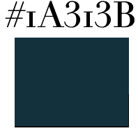

Do typography like a boss: how Monki brought hipster-like Helvetica font to their quirky fashion brand

The typography of high street shop Monki is truly something fascinating. This sans-serif, modern, **Helvetica Neue** family font instantly attracts attention and has become a staple of Monki`s brand. The font used for the logo is similar to **Circular-Book-S Regular** but with customized features on letters "M" and "I" showcasing Monki`s unorthodox approach to fashion.

The font choice in itself is quite fascinating since this typeface seems to exhibit qualities both fitting most fashion brands and still have original quirky qualities. It has a luxury feeling which comes from its straight, sharp lines as well as the monospace - the letters have the same width. In addition, the font appears to have quite a lot of white space which adds to the luxurious feeling and also indicates that Monki is a quality shop.  

 Furthermore, the colour of the typeface is an interesting design decision. It is a deep cyan/deep cerulean shade which looks black from afar. The colour choice adds to the simplistic, modern aesthetic of the Monki logo as well as fits nicely with the brand as a whole reflecting its authenticity. 

Looking at typographical design choices for the Monki logo we can see the brands core values and aesthetics being reflected. Monki mixes [Scandinavian minimalism](https://hmgroup.com/brands/monki.html) with creative and fun street style which can be seen reflect in minimalistic logo with fun stylizations on first and last letters. 

Moreover, the choice to make the logo in all capital letters is also worth looking at: The style is reminiscent of those seen in many of the fashion magazines e.g *Vogue, Elle, Harper’s Bazaar* etc. as well as seen in other retailer logos such as *Zara* or *Mango*. Also, the all caps style can be seen as a statement which connects to Monki`s mission of empowering young women through encouraging brave and creative fashion choices that make them feel great [about themselves](https://www.monki.com/we-are-monki/we-are-monki/the-monki-tale/). 

Besides their empowering messages on body positivity and self-love Monki is a brand that is commited to be a sustainable fashion brand that brings new trends to attention. The popular Helvetica family typography used for the logo has a hipster-like feeling which suits this idea of a trend-forward brand and together with simplistic design appeals to younger audiences.

 Overall the typeface of Monki showcases both the brands quirkiness as well as its key values helping to create a fun and fashionable logo.

References:

* <!--\[if !supportLists]-->·      <!--\[endif]-->Hmgroup.com. (2010). *H&M group | Monki*. \[online] Available at: https://hmgroup.com/brands/monki.html \[Accessed 20 Oct. 2020].
* <!--\[if !supportLists]-->·      <!--\[endif]-->Usborne, S. (2014). *How did “hipster sans serif” become the defining font of 2014?* \[online] The Independent. Available at: https://www.independent.co.uk/life-style/fashion/features/how-did-hipster-sans-serif-become-defining-font-2014-9904544.html \[Accessed 23 Oct. 2020].
* <!--\[if !supportLists]-->·      <!--\[endif]-->www.monki.com. (n.d.). *About us*. \[online] Available at: https://www.monki.com/we-are-monki/we-are-monki/the-monki-tale/ \[Accessed 20 Oct. 2020].