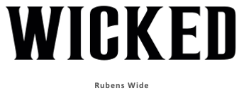

Read on to see how witches, spells and catchy songs were embodied in this wickedly enchanting font....

### **BOOK TO PLAY:**

The origin story of the iconic 2003 Broadway musical *"Wicked"* starts with the 1995 novel by Gregory Maguire *"Wicked: The Life and Times of the Wicked Witch of the West".*  Both the play and book are in a way a prequel to the story of Oz we already are so familiar with and take the audience back in time to the Land of Oz before tornado brings Dorothy from Kansas. The main storyline is centred around Elphaba (Wicked Witch of the West) and Glinda (the Good Witch) showing their lives and experiences that shaped them and led both witches from being friends to being enemies. *"Wicked"* focuses on the themes of friendship, identity and bravery to follow one`s beliefs. (Pokedoff, 2017) 

### **TYPEFACE MAGIC:** 

The typography of *"Wicked"* is as enchanting as the main storyline. Bold, all cap, serif font captivates the attention from the first look. The typeface chosen reveals as much about the main themes and characters of the musical as any other imagery would: Sharp serifs edges on the letters in bold suggest it is an emphatic font. These font characteristics reflect the main character Elphaba, who is both bold, strong and not afraid to defy societal conventions. However the sharpness is only seen at the serifs, and the font overall has a certain softness to it, illustrating the complexity of Elphaba`s character and shows there is more to her than just being wicked which fits perfectly with the story itself and showing the other side the famous Land of Oz story. Furthermore, the precise name of the font is a bit more of a mystery, the two fonts looking most similar to the one used in the musical poster are **Sheepman Regular** and **Rubens Wide:** 

### **DESIGN TO REVEALING ANTAGONISTIC FORCES:** 

When looking at the complete picture of the musical poster, the design choices seem to reveal even more fascinating things about the story. The colour of the font for the title *"Wicked"* is white; which is an interesting choice in itself as white is usually associated with innocence and vulnerability. This reflects the complexity of the main characters and suggests a double meaning where perhaps what is seen as wicked is truly not i.e heroes and villains switch places. 

In addition, design of the complete poster further confirms this. The "good" witch Glinda in white seems to be whispering something to the "wicked" witch Elphaba dressed in black; the colour choice for the characters, of black and white, illustrates the traditional antagonistic forces of "good vs. evil" however the title colouring implicates a double meaning. 

Overall, the bold serif font, and clever colour choices of typographical and graphical design for the 2003 Broadway musical *"Wicked"* are great at showcasing the main characters and themes both explicitly and implicitly offering an enchanting story for the audiences. 

**REFERENCES:** 

* <!--\[if !supportLists]-->·      <!--\[endif]-->Pokedoff, Lauren. “What Is ‘Wicked’ Truly About?” *Show-Score.com*, 28 Feb. 2017, [www.show-score.com/blog/what-is-wicked-truly-about. Accessed 25 Oct. 2020](http://www.show-score.com/blog/what-is-wicked-truly-about.%20Accessed%2025%20Oct.%202020).
* <!--\[if !supportLists]-->·      <!--\[endif]-->“Wicked (Musical) Font.” *Fontmeme.com*, fontmeme.com/wicked-musical-font/. Accessed 25 Oct. 2020