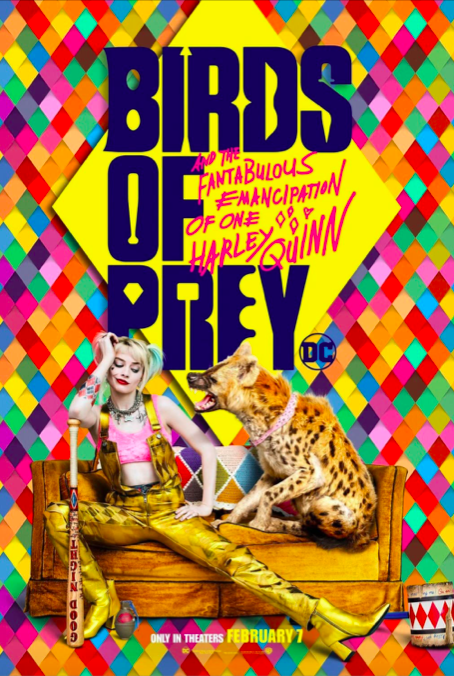

 Bold sans serifs and quirky scripts – a perfect combination typeface for the new DC comic adaptation: *“Birds of Prey: Fantabulous Emancipation of One Harley Quinn”.*

**WEAPONS AND MANIC NATURE:** 

The main title of the film is written in big, bold customized **Monotype's Smart Sans** font. The customization of the font can be seen from illustrations of Harley's and Birds of Prey (Huntress, Black Canary, Cassandra and Officer Montoya) weapons hidden amongst the letters as a sort of "Easter Egg" for the fans. It is also an interesting way to introduce the characters that are otherwise not featured in the poster (or at least not in all the poster versions).

Furthermore, the movie's impressive subtitle, custom made Pentagram's **Hysteria Hand** perfectly captures Harley Quinn's manic nature. The script, handwritten, font that looks like it was scribbled in haste, is meant to reference Harley's unhinged mind. The designer of the font, from Pentagram, Emily Oberman, said the font is meant to look "off kilter (yet optimistic) like **handwriting that fell into a vat of Gotham's most toxic acid**".

**QUIRKY DESIGN:** 

Continuing with the subtitle, it has more interesting details withing itself. The surrounding doodles of hearts and harlequin diamonds add a touch of humour (and madness) which creates authenticity making this an **emphatic typeface.**

**Harley Quinn's character shines strongly in the subtitle** which is why its placing is so interesting - it seems to almost go over the main title. Oberman explains that the design idea comes from Harley breaking the fourth wall a lot in the movie and "idea for the subtitle was about her **taking over and inserting herself into the brand**".

The placing of the title and subtitle in the poster is quite interesting: it is centred and instantly draws attention of the audience which allows to spot all the hidden details easier. 

Let’s not forget the colour of the font – which both highlights the whole movies aesthetic as well as referring back to the main characters. In the film there is a disparity between dark and gloomy vs neon and bright aesthetics. Mostly the neon pink colour of the subtitle, seen in the poster below) is a nod to Harley Quinn which favours bright colours overall, and the almost manic use of bright colours hints towards her crazy nature. In addition, the more subdued blue colour of the title reflects the other characters. 

Overall, the creators of the poster have done a great job creating a design that will set apart this DC comic adaptation from other superhero movies with its quirky but fun typeface. 

References: 

* <!--\[if !supportLists]-->·      <!--\[endif]-->“‘Birds of Prey.’” *Pentagram*, <https://www.pentagram.com/work/birds-of-prey>  Accessed 6 Nov. 2020.
* <!--\[if !supportLists]-->·      <!--\[endif]-->‌“‘Birds of Prey’ — Story.” *Pentagram*, <https://www.pentagram.com/work/birds-of-prey/story> Accessed 6 Nov. 2020.
* <!--\[if !supportLists]-->·      <!--\[endif]-->‌Brewer, Jenny. “Behind Pentagram’s Graphic Identity for DC’s Harley Quinn Film, Birds of Prey.” *Www.Itsnicethat.com*, 6 Feb. 2020, <https://www.itsnicethat.com/news/pentagram-emily-oberman-harley-quinn-birds-of-prey-graphic-design-060220>Accessed 6 Nov. 2020.
* <!--\[if !supportLists]-->·      <!--\[endif]-->‌Hodson, Christina. “Birds of Prey: And the Fantabulous Emancipation of One Harley Quinn.” *IMDb*, 5 Feb. 2020, <https://www.imdb.com/title/tt7713068/>Accessed 6 Nov. 2020.