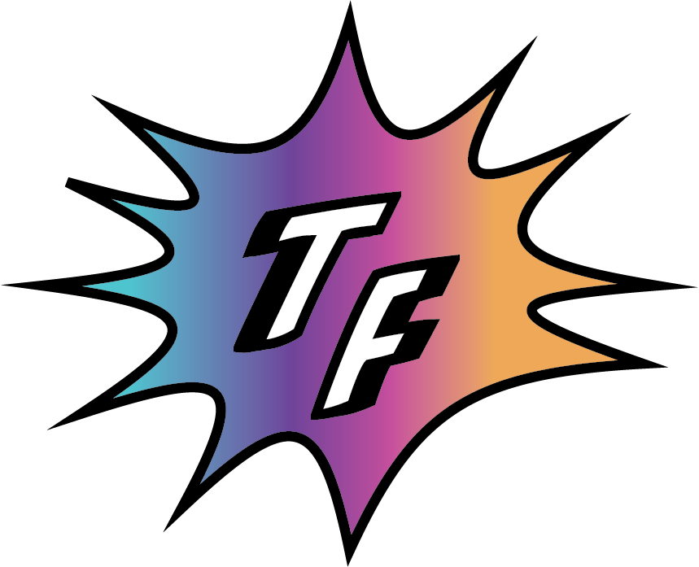
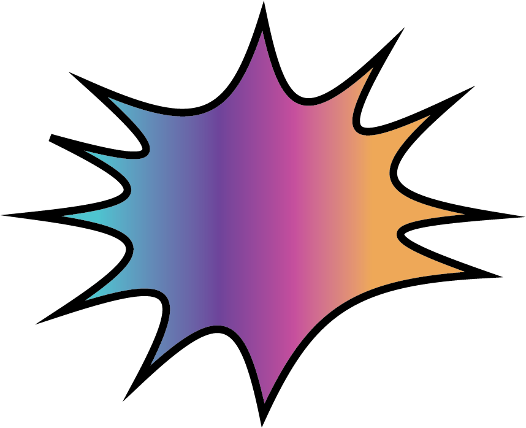
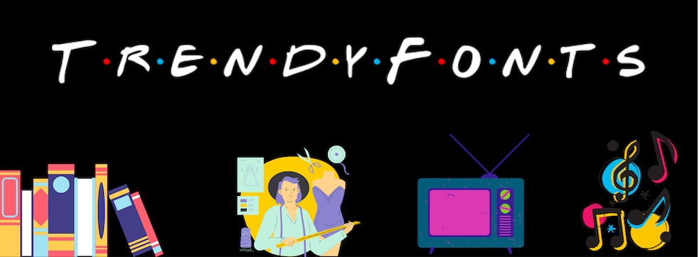

### ABOUT ME:

Hello, my name is Ugne and I`m a second - year Media, Journalism and Publishing student at Oxford Brookes. I am so far undecided whether my interests lie with the publishing or journalism pathways of my course and therefore like to try out as many activities, as possible, in both fields. 

### ABOUT MY BLOG:

I like to explore things that excite me and since there are so many it is hard to narrow my interests into one area. This is one of the reasons why I decided to go with a theme of popular culture for my blog since it largely encompasses my hobbies and things, I love to research more e.g books, fashion, TV/movies, music, art etc. The idea behind this blog is to examine which fonts are currently trending in the popular culture, why they were chosen and how they are used to achieve a certain purpose.

My blog design decisions were mainly based on showcasing the main theme of the blog. Starting with the logo, a simple initial of the website name “Trendy Fonts”, written in a sans-serif **Biff Bam Boom** font. The sans-serif typeface was chosen because I wanted to underline the fun and dynamic nature of the blog and extra shadowing done on the letters is to create a 3D effect make the initials pop out more. In addition, I chose this typeface because it is similar to fonts used for comic books (an item which is inseparable from popular culture). The comic speech bubble surrounding the logo was chosen for the same reason – to fit the main theme. The colours for the comic bubble are the gradient of the colours used for header images to make both the logo and header fit the same aesthetic.

The favicon for the website is just a simplified version of the logo. I removed the letter initials and left the comic bubble as it looks better in a small format and makes it pop out more.

The header image was created by me to reflect the main areas in which typography will be explored in my blog such as books, fashion, TV and music. In addition, I added the website name in the font used for TV series “Friends”  to underline the theme of the blog. As the TV has long since become a staple of popular culture. The black background was chosen to make the images and the title stand out more.

I decided to go with a colorful design choice for both my header image and the website logo because I wanted it to showcase the diversity of subjects explored in the blog as well as underline the fun and dynamic nature of popular culture.

**DISCLAIMER:**

The header drawings are taken from Canva and not made by me, though it was me that designed the complete header look. The “Trendy Fonts” friends font was gotten from font generator online. Pictures used for the articles belong to linked sites/people and are only used to illustrate the typeface I am referring to in my articles.