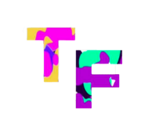

### ABOUT ME:

Hello, my name is Ugne and I`m a second - year Media, Journalism and Publishing student at Oxford Brookes. I am so far undecided whether my interests lie with the publishing or journalism pathways of my course and therefore like to try out as many activities, as possible, in both fields. 

### ABOUT MY BLOG:

I like to explore things that excite me and since there are so many it is hard to narrow my interests into one area. This is one of the reasons why I decided to go with a theme of popular culture for my blog since it largely encompasses my hobbies and things, I love to research more e.g books, fashion, TV/movies, music, art etc.  The idea behind this blog is to examine which fonts are currently trending in the popular culture, why they were chosen and how they are used to achieve a certain purpose. 
The logo is a simple initial of the website name “Trendy Fonts” as I wanted it the main focus to be the splash of colours. 

The header image was created by me to reflect the main areas in which typography will be explored in my blog such as books, fashion, TV and music. In addition, I added the website name in the font used for TV series “Friends” to underline the theme of the blog. The black background was chosen to make the images and the title pop more.

I decided to go with a colorful design choice for both my header image and the website logo because I wanted it to showcase the diversity of subjects explored in the blog as well as underline the fun and dynamic nature of popular culture.